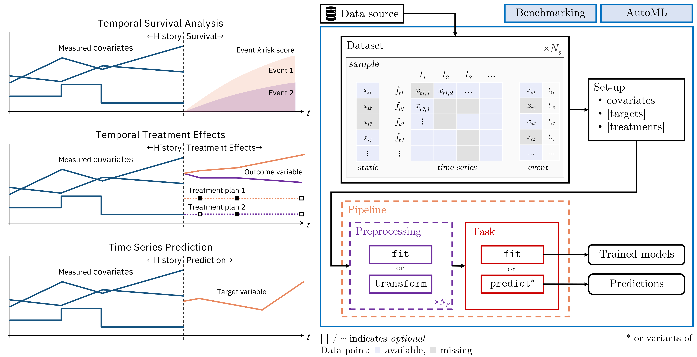

<!-- These are examples of badges you might want to add to your README:
     please update the URLs accordingly

[](https://anaconda.org/conda-forge/temporai)
[](https://pepy.tech/project/temporai)
-->

<!-- exclude_docs -->
[](https://colab.research.google.com/github/vanderschaarlab/temporai/blob/main/tutorials/usage/tutorial04_prediction.ipynb)
[](https://temporai.readthedocs.io/en/latest/?badge=latest)

[](https://www.python.org/downloads/release/python-370/)
[](https://pypi.org/project/temporai/)
[](https://pepy.tech/project/temporai)
[](./LICENSE.txt)

[](https://github.com/vanderschaarlab/temporai/actions/workflows/test.yml)
[](https://github.com/vanderschaarlab/temporai/actions/workflows/test.yml)
[](https://codecov.io/gh/vanderschaarlab/temporai)

[](https://arxiv.org/abs/2301.12260)
[](https://join.slack.com/t/vanderschaarlab/shared_invite/zt-1u2rmhw06-sHS5nQDMN3Ka2Zer6sAU6Q)
[](https://www.vanderschaar-lab.com/)
<!-- exclude_docs_end -->

#  TemporAI

<!-- exclude_docs -->
> **⚗️ Status:** This project is still in *alpha*, and the API may change without warning.  
<!-- exclude_docs_end -->
<!-- include_docs
:::{important}
**Status:** This project is still in *alpha*, and the API may change without warning.  
:::
include_docs_end -->


## 📃 Overview

*TemporAI* is a Machine Learning-centric time-series library for medicine.  The tasks that are currently of focus in TemporAI are: time-to-event (survival) analysis with time-series data, treatment effects (causal inference) over time, and time-series prediction. Data preprocessing methods, including missing value imputation for static and temporal covariates, are provided. AutoML tools for hyperparameter tuning and pipeline selection are also available.

### How is TemporAI unique?

* **🏥 Medicine-first:** Focused on use cases for medicine and healthcare, such as temporal treatment effects, survival analysis over time, imputation methods, models with built-in and post-hoc interpretability, ... See [methods](./#-methods).
* **🏗️ Fast prototyping:** A plugin design allowing for on-the-fly integration of new methods by the users.
* **🚀 From research to practice:** Relevant novel models from research community adapted for practical use.
* **🌍 A healthcare ecosystem vision:** A range of interactive demonstration apps, new medical problem settings, interpretability tools, data-centric tools etc. are planned.

### Key concepts

<div align="center">

<!-- exclude_docs -->

<!-- exclude_docs_end -->
<!-- include_docs

include_docs_end -->

</div>


## 🚀 Installation

```bash
$ pip install temporai
```
or from source, using
```bash
$ pip install .
```


## 💥 Sample Usage
* List the available plugins
```python
from tempor.methods import plugin_loader

print(plugin_loader.list())
```

* Use a time-to-event (survival) analysis model
```python
from tempor.data.datasources import PBCDataSource
from tempor.methods import plugin_loader

# Load a time-to-event dataset:
dataset = PBCDataSource().load()

# Initialize the model:
model = plugin_loader.get("time_to_event.dynamic_deephit")

# Train:
model.fit(dataset)

# Make risk predictions:
prediction = model.predict(dataset, horizons=[0.25, 0.50, 0.75])
```

* Use a temporal treatment effects model
```python
import numpy as np

from tempor.data.datasources import DummyTemporalTreatmentEffectsDataSource
from tempor.methods import plugin_loader

# Load a dataset with temporal treatments and outcomes:
dataset = DummyTemporalTreatmentEffectsDataSource(
    temporal_covariates_missing_prob=0.0,
    temporal_treatments_n_features=1,
    temporal_treatments_n_categories=2,
).load()

# Initialize the model:
model = plugin_loader.get("treatments.temporal.regression.crn_regressor", epochs=20)

# Train:
model.fit(dataset)

# Define target variable horizons for each sample:
horizons = [
    tc.time_indexes()[0][len(tc.time_indexes()[0]) // 2 :] for tc in dataset.time_series
]

# Define treatment scenarios for each sample:
treatment_scenarios = [
    [np.asarray([1] * len(h)), np.asarray([0] * len(h))] for h in horizons
]

# Predict counterfactuals:
counterfactuals = model.predict_counterfactuals(
    dataset,
    horizons=horizons,
    treatment_scenarios=treatment_scenarios,
)
```

* Use a missing data imputer
```python
from tempor.data.datasources import SineDataSource
from tempor.methods import plugin_loader

dataset = SineDataSource(with_missing=True).load()
static_data_n_missing = dataset.static.dataframe().isna().sum().sum()
temporal_data_n_missing = dataset.time_series.dataframe().isna().sum().sum()

print(static_data_n_missing, temporal_data_n_missing)
assert static_data_n_missing > 0
assert temporal_data_n_missing > 0

# Initialize the model:
model = plugin_loader.get("preprocessing.imputation.temporal.bfill")

# Train:
model.fit(dataset)

# Impute:
imputed = model.transform(dataset)
temporal_data_n_missing = imputed.time_series.dataframe().isna().sum().sum()

print(static_data_n_missing, temporal_data_n_missing)
assert temporal_data_n_missing == 0
```

* Use a one-off classifier (prediction)
```python
from tempor.data.datasources import SineDataSource
from tempor.methods import plugin_loader

dataset = SineDataSource().load()

# Initialize the model:
model = plugin_loader.get("prediction.one_off.classification.nn_classifier", n_iter=50)

# Train:
model.fit(dataset)

# Predict:
prediction = model.predict(dataset)
```

* Use a temporal regressor (forecasting)
```python
from tempor.data.datasources import DummyTemporalPredictionDataSource
from tempor.methods import plugin_loader

# Load a dataset with temporal targets.
dataset = DummyTemporalPredictionDataSource(temporal_covariates_missing_prob=0.0).load()

# Initialize the model:
model = plugin_loader.get("prediction.temporal.regression.seq2seq_regressor", epochs=10)

# Train:
model.fit(dataset)

# Predict:
prediction = model.predict(dataset, n_future_steps=5)
```

* Benchmark models, time-to-event task
```python
from tempor.benchmarks import benchmark_models
from tempor.methods import plugin_loader
from tempor.methods.pipeline import pipeline
from tempor.data.datasources import PBCDataSource

testcases = [
    (
        "pipeline1",
        pipeline(
            [
                "preprocessing.scaling.temporal.ts_minmax_scaler",
                "time_to_event.dynamic_deephit",
            ]
        )({"ts_coxph": {"n_iter": 100}}),
    ),
    (
        "plugin1",
        plugin_loader.get("time_to_event.dynamic_deephit", n_iter=100),
    ),
    (
        "plugin2",
        plugin_loader.get("time_to_event.ts_coxph", n_iter=100),
    ),
]
dataset = PBCDataSource().load()

aggr_score, per_test_score = benchmark_models(
    task_type="time_to_event",
    tests=testcases,
    data=dataset,
    n_splits=2,
    random_state=0,
    horizons=[2.0, 4.0, 6.0],
)

print(aggr_score)
```

* Serialization
```python
from tempor.utils.serialization import load, save
from tempor.methods import plugin_loader

# Initialize the model:
model = plugin_loader.get("prediction.one_off.classification.nn_classifier", n_iter=50)

buff = save(model)  # Save model to bytes.
reloaded = load(buff)  # Reload model.

# `save_to_file`, `load_from_file` also available in the serialization module.
```

* AutoML - search for the best pipeline for your task
```python
from tempor.automl.seeker import PipelineSeeker
from tempor.data.datasources import SineDataSource

dataset = SineDataSource().load()

# Specify the AutoML pipeline seeker for the task of your choice, providing candidate methods,
# metric, preprocessing steps etc.
seeker = PipelineSeeker(
    study_name="my_automl_study",
    task_type="prediction.one_off.classification",
    estimator_names=[
        "cde_classifier",
        "ode_classifier",
        "nn_classifier",
    ],
    metric="aucroc",
    dataset=dataset,
    return_top_k=3,
    num_iter=100,
    tuner_type="bayesian",
    static_imputers=["static_tabular_imputer"],
    static_scalers=[],
    temporal_imputers=["ffill", "bfill"],
    temporal_scalers=["ts_minmax_scaler"],
)

# The search will return the best pipelines.
best_pipelines, best_scores = seeker.search()  # doctest: +SKIP
```


<!-- include_docs
{#methods}include_docs_end -->
## 🔑 Methods


### Time-to-Event (survival) analysis over time

Risk estimation given event data (category: `time_to_event`)

| Name | Description| Reference |
| --- | --- | --- |
| `dynamic_deephit` | Dynamic-DeepHit incorporates the available longitudinal data comprising various repeated measurements (rather than only the last available measurements) in order to issue dynamically updated survival predictions | [Paper](https://pubmed.ncbi.nlm.nih.gov/30951460/) |
| `ts_coxph` | Create embeddings from the time series and use a CoxPH model for predicting the survival function| --- |
| `ts_xgb` | Create embeddings from the time series and use a SurvivalXGBoost model for predicting the survival function| --- |


### Treatment effects

#### One-off
Treatment effects estimation where treatments are a one-off event.

<!--
* Classification on the outcomes (category: `treatments.one_off.classification`)
-->

* Regression on the outcomes (category: `treatments.one_off.regression`)

| Name | Description| Reference |
| --- | --- | --- |
| `synctwin_regressor` | SyncTwin is a treatment effect estimation method tailored for observational studies with longitudinal data, applied to the LIP setting: Longitudinal, Irregular and Point treatment.  | [Paper](https://proceedings.neurips.cc/paper/2021/hash/19485224d128528da1602ca47383f078-Abstract.html) |

#### Temporal
Treatment effects estimation where treatments are temporal (time series).

* Classification on the outcomes (category: `treatments.temporal.classification`)

| Name | Description| Reference |
| --- | --- | --- |
| `crn_classifier` | The Counterfactual Recurrent Network (CRN), a sequence-to-sequence model that leverages the available patient observational data to estimate treatment effects over time. | [Paper](https://arxiv.org/abs/2002.04083) |

* Regression on the outcomes (category: `treatments.temporal.regression`)

| Name | Description| Reference |
| --- | --- | --- |
| `crn_regressor` | The Counterfactual Recurrent Network (CRN), a sequence-to-sequence model that leverages the available patient observational data to estimate treatment effects over time. | [Paper](https://arxiv.org/abs/2002.04083) |


### Prediction

#### One-off
Prediction where targets are static.

* Classification (category: `prediction.one_off.classification`)

| Name | Description| Reference |
| --- | --- | --- |
| `nn_classifier` | Neural-net based classifier. Supports multiple recurrent models, like RNN, LSTM, Transformer etc.  | --- |
| `ode_classifier` | Classifier based on ordinary differential equation (ODE) solvers.  | --- |
| `cde_classifier` | Classifier based Neural Controlled Differential Equations for Irregular Time Series.  | [Paper](https://arxiv.org/abs/2005.08926) |
| `laplace_ode_classifier` | Classifier based Inverse Laplace Transform (ILT) algorithms implemented in PyTorch.  | [Paper](https://arxiv.org/abs/2206.04843) |

* Regression (category: `prediction.one_off.regression`)

| Name | Description| Reference |
| --- | --- | --- |
| `nn_regressor` | Neural-net based regressor. Supports multiple recurrent models, like RNN, LSTM, Transformer etc.  | --- |
| `ode_regressor` | Regressor based on ordinary differential equation (ODE) solvers.  | --- |
| `cde_regressor` | Regressor based Neural Controlled Differential Equations for Irregular Time Series.  | [Paper](https://arxiv.org/abs/2005.08926)
| `laplace_ode_regressor` | Regressor based Inverse Laplace Transform (ILT) algorithms implemented in PyTorch.  | [Paper](https://arxiv.org/abs/2206.04843) |

#### Temporal
Prediction where targets are temporal (time series).

* Classification (category: `prediction.temporal.classification`)

| Name | Description| Reference |
| --- | --- | --- |
| `seq2seq_classifier` | Seq2Seq prediction, classification | --- |

* Regression (category: `prediction.temporal.regression`)

| Name | Description| Reference |
| --- | --- | --- |
| `seq2seq_regressor` | Seq2Seq prediction, regression | --- |


### Preprocessing

#### Feature Encoding

* Static data (category: `preprocessing.encoding.static`)

| Name | Description| Reference |
| --- | --- | --- |
| `static_onehot_encoder` | One-hot encode categorical static features | --- |

* Temporal data (category: `preprocessing.encoding.temporal`)

| Name | Description| Reference |
| --- | --- | --- |
| `ts_onehot_encoder` | One-hot encode categorical time series features | --- |

#### Imputation

* Static data (category: `preprocessing.imputation.static`)

| Name | Description| Reference |
| --- | --- | --- |
| `static_tabular_imputer` | Use any method from [HyperImpute](https://github.com/vanderschaarlab/hyperimpute) (HyperImpute, Mean, Median, Most-frequent, MissForest, ICE, MICE, SoftImpute, EM, Sinkhorn, GAIN, MIRACLE, MIWAE) to impute the static data | [Paper](https://arxiv.org/abs/2206.07769) |

* Temporal data (category: `preprocessing.imputation.temporal`)

| Name | Description| Reference |
| --- | --- | --- |
| `ffill` | Propagate last valid observation forward to next valid  | --- |
| `bfill` | Use next valid observation to fill gap | --- |
| `ts_tabular_imputer` | Use any method from [HyperImpute](https://github.com/vanderschaarlab/hyperimpute) (HyperImpute, Mean, Median, Most-frequent, MissForest, ICE, MICE, SoftImpute, EM, Sinkhorn, GAIN, MIRACLE, MIWAE) to impute the time series data | [Paper](https://arxiv.org/abs/2206.07769) |


#### Scaling

* Static data (category: `preprocessing.scaling.static`)

| Name | Description| Reference |
| --- | --- | --- |
| `static_standard_scaler` | Scale the static features using a StandardScaler | --- |
| `static_minmax_scaler` | Scale the static features using a MinMaxScaler | --- |

* Temporal data (category: `preprocessing.scaling.temporal`)

| Name | Description| Reference |
| --- | --- | --- |
| `ts_standard_scaler` | Scale the temporal features using a StandardScaler | --- |
| `ts_minmax_scaler` | Scale the temporal features using a MinMaxScaler | --- |


## 📖 Tutorials

### Data

- [](https://colab.research.google.com/github/vanderschaarlab/temporai/blob/main/tutorials/data/tutorial01_data_format.ipynb) - [Data Format](./tutorials/data/tutorial01_data_format.ipynb)
- [](https://colab.research.google.com/github/vanderschaarlab/temporai/blob/main/tutorials/data/tutorial02_datasets.ipynb) - [Datasets](./tutorials/data/tutorial02_datasets.ipynb)
- [](https://colab.research.google.com/github/vanderschaarlab/temporai/blob/main/tutorials/data/tutorial03_dataloaders.ipynb) - [Data Loaders](./tutorials/data/tutorial03_dataloaders.ipynb)
- [](https://colab.research.google.com/github/vanderschaarlab/temporai/blob/main/tutorials/data/tutorial04_data_splitting.ipynb) - [Data Splitting](./tutorials/data/tutorial04_data_splitting.ipynb)

### User Guide
- [](https://colab.research.google.com/github/vanderschaarlab/temporai/blob/main/tutorials/usage/tutorial01_plugins.ipynb) - [Plugins](./tutorials/usage/tutorial01_plugins.ipynb)
- [](https://colab.research.google.com/github/vanderschaarlab/temporai/blob/main/tutorials/usage/tutorial02_imputation.ipynb) - [Imputation](./tutorials/usage/tutorial02_imputation.ipynb)
- [](https://colab.research.google.com/github/vanderschaarlab/temporai/blob/main/tutorials/usage/tutorial03_scaling.ipynb) - [Scaling](./tutorials/usage/tutorial03_scaling.ipynb)
- [](https://colab.research.google.com/github/vanderschaarlab/temporai/blob/main/tutorials/usage/tutorial04_prediction.ipynb) - [Prediction](./tutorials/usage/tutorial04_prediction.ipynb)
- [](https://colab.research.google.com/github/vanderschaarlab/temporai/blob/main/tutorials/usage/tutorial05_time_to_event.ipynb) - [Time-to-event Analysis](./tutorials/usage/tutorial05_time_to_event.ipynb)
- [](https://colab.research.google.com/github/vanderschaarlab/temporai/blob/main/tutorials/usage/tutorial06_treatments.ipynb) - [Treatment Effects](./tutorials/usage/tutorial06_treatments.ipynb)
- [](https://colab.research.google.com/github/vanderschaarlab/temporai/blob/main/tutorials/usage/tutorial07_pipeline.ipynb) - [Pipeline](./tutorials/usage/tutorial07_pipeline.ipynb)
- [](https://colab.research.google.com/github/vanderschaarlab/temporai/blob/main/tutorials/usage/tutorial08_benchmarks.ipynb) - [Benchmarks](./tutorials/usage/tutorial08_benchmarks.ipynb)
- [](https://colab.research.google.com/github/vanderschaarlab/temporai/blob/main/tutorials/usage/tutorial09_automl.ipynb) - [AutoML](./tutorials/usage/tutorial09_automl.ipynb)

### Extending TemporAI
- [](https://colab.research.google.com/github/vanderschaarlab/temporai/blob/main/tutorials/extending/tutorial01_custom_plugin.ipynb) - [Writing a Custom Plugin](./tutorials/extending/tutorial01_custom_plugin.ipynb)
- [](https://colab.research.google.com/github/vanderschaarlab/temporai/blob/main/tutorials/extending/tutorial02_testing_custom_plugin.ipynb) - [Testing a Custom Plugin](./tutorials/extending/tutorial02_testing_custom_plugin.ipynb)


<!-- exclude_docs -->
## 📘 Documentation

See the project documentation [here](https://temporai.readthedocs.io/en/latest/).
<!-- exclude_docs_end -->


<!--- Reusable --->
  [van der Schaar Lab]:    https://www.vanderschaar-lab.com/
  [docs]:                  https://temporai.readthedocs.io/en/latest/
<!-- exclude_docs -->
  [docs/user_guide]:       https://temporai.readthedocs.io/en/latest/user_guide/index.html
<!-- exclude_docs_end -->

## 🔨 Tests and Development

Install the testing dependencies using:
```bash
pip install .[testing]
```
The tests can be executed using:
```bash
pytest -vsx
```

For local development, we recommend that you should install the `[dev]` extra, which includes `[testing]` and some additional dependencies:
```bash
pip install .[dev]
```

For development and contribution to TemporAI, see:
* 📓 [Extending TemporAI tutorials](./tutorials/extending/)
* 📃 [Contribution guide](./CONTRIBUTING.md)
* 👩‍💻 [Developer's guide](./docs/dev_guide.md)

## ✍️ Citing

If you use this code, please cite the associated paper:
```
@article{saveliev2023temporai,
  title={TemporAI: Facilitating Machine Learning Innovation in Time Domain Tasks for Medicine},
  author={Saveliev, Evgeny S and van der Schaar, Mihaela},
  journal={arXiv preprint arXiv:2301.12260},
  year={2023}
}
```
