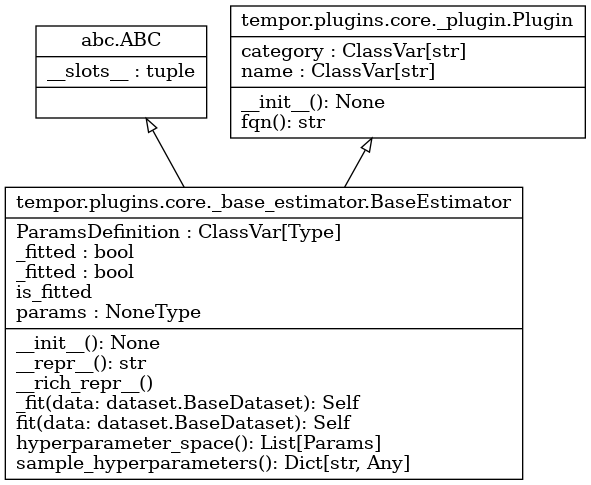
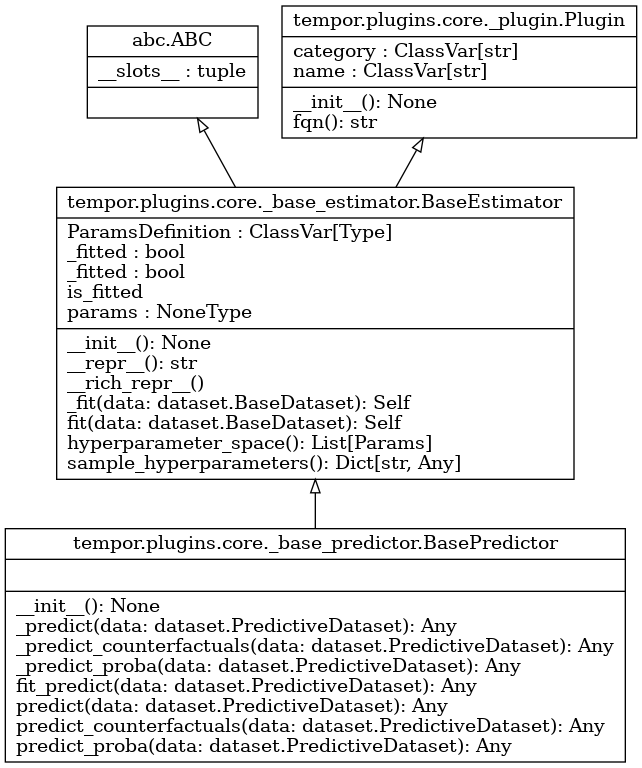
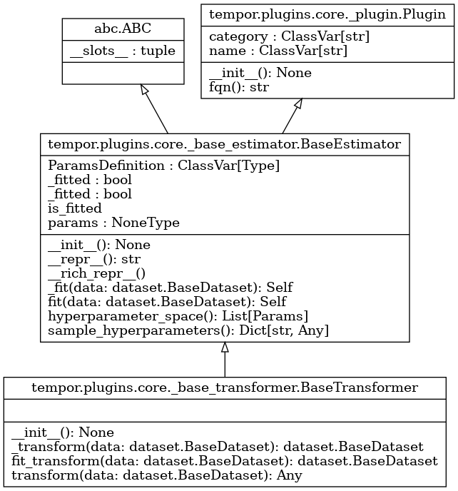
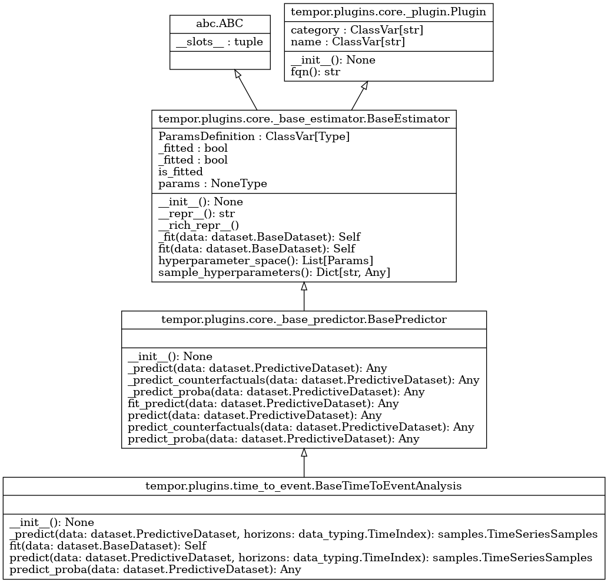
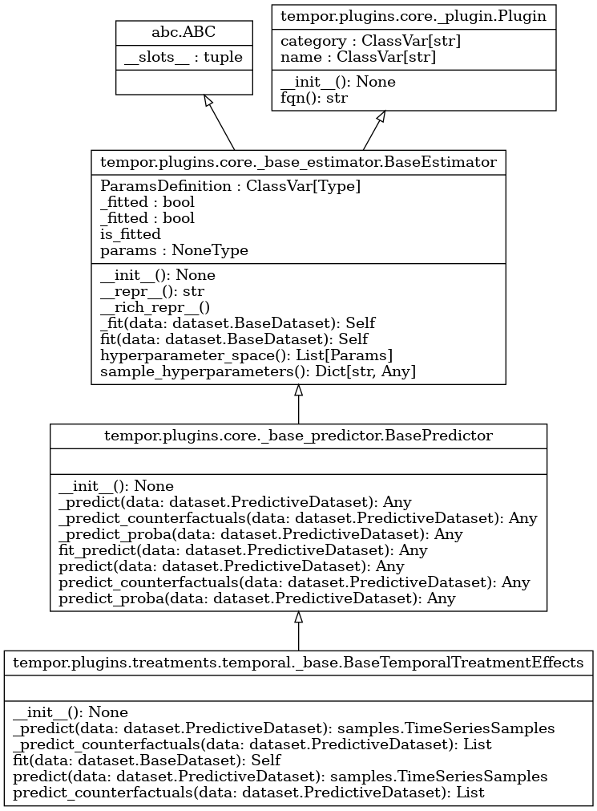
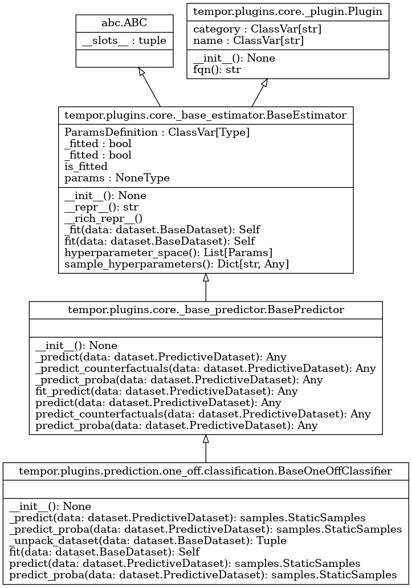
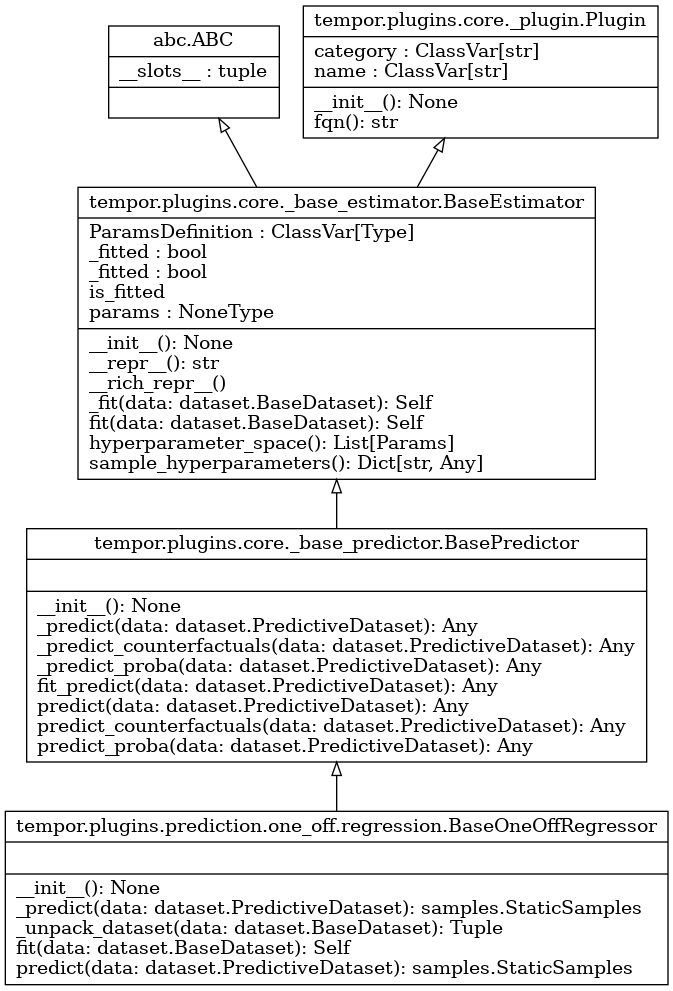

# Developer's Guide

If you are looking to contribute to *TemporAI*, this guide is a good starting point.


## Contributing

✅ Please read the [Contributing Guide](contributing.md) first.


## Project layout

### Project root
<!--
.github/: GitHub workflows (CI/CD)
docs/: Sphinx documentation content
src/: Source code
tests/: Tests (pytest)
tutorials/: Jupyter notebook tutorials
<root files>: Configuration files, README, and LICENSE
-->
```
.
├── .github/: GitHub workflows (CI/CD)
├── docs/: Sphinx documentation content
├── src/: Source code
├── tests/: Tests (pytest)
├── tutorials/: Jupyter notebook tutorials
└── <root files>: Configuration files, README, and LICENSE
```

### Source code
The source code is located under [`src/tempor`](repo-code:src/tempor), the code organization is shown below.
<!--
Use: https://tree.nathanfriend.io/
tempor
  automl: AutoML tools
  benchmarks: Benchmarking tools
  config: Library config
  core: Core code, such as global utils
  data: format
  exc: Exceptions
  log: Logger
  models: Model components
  plugins: Plugins
    core: The core plugin mechanism, base classes
    pipeline: Pipeline mechanism
    prediction: Prediction plugins
    preprocessing: Preprocessing plugins
    time_to_event: Time-to-event plugins
    treatments: Treatment effects plugins
  utils: Utilities
    dataloaders: Data loaders for provided datasets
    serialization: Serialization tools
-->
```
.
└── tempor/
    ├── automl: AutoML tools
    ├── benchmarks: Benchmarking tools
    ├── config: Library config
    ├── core: Core code, such as global utils
    ├── data: format
    ├── exc: Exceptions
    ├── log: Logger
    ├── models: Model components
    ├── plugins: Plugins/
    │   ├── core: The core plugin mechanism, base classes
    │   ├── pipeline: Pipeline mechanism
    │   ├── prediction: Prediction plugins
    │   ├── preprocessing: Preprocessing plugins
    │   ├── time_to_event: Time-to-event plugins
    │   └── treatments: Treatment effects plugins
    └── utils: Utilities/
        ├── dataloaders: Data loaders for provided datasets
        └── serialization: Serialization tools
```

### Tests

Tests located in the [`tests`](repo-code:tests) directory follow the directory structure of the source code.

### Config files
The project contains the following config files:
* [`.coveragerc`](repo-code:.coveragerc): [coverage](https://coverage.readthedocs.io) config.
* [`.isort.cfg`](repo-code:.isort.cfg): [isort](https://pycqa.github.io/isort/) config.
* [`.pre-commit-config.yaml`](repo-code:.pre-commit-config.yaml): [pre-commit](https://pre-commit.com/) config.
* [`.readthedocs.yml`](repo-code:.readthedocs.yml): [ReadTheDocs](https://docs.readthedocs.io/) config.
* [`codecov.yml`](repo-code:codecov.yml): [codecov](https://docs.codecov.com/docs) config.
* [`mypy.ini`](repo-code:mypy.ini): [mypy](https://mypy.readthedocs.io/) config.
* [`pyproject.toml`](repo-code:pyproject.toml): miscellaneous setup and tools configuration in the [pyproject.toml](https://pip.pypa.io/en/stable/reference/build-system/pyproject-toml/) form.
* [`pytest.ini`](repo-code:pytest.ini): [pytest](https://docs.pytest.org/) config.
* [`setup.cfg`](repo-code:setup.cfg): miscellaneous setup and tools configuration in the setuptools [setup.cfg](https://setuptools.pypa.io) config.
* [`tox.ini`](repo-code:tox.ini): [tox](https://tox.wiki/) config.


## Data format

Please familiarize yourself with the data format we use.

1. Go through the [data tutorials](user_guide/data/index.md).
2. See the following parts of the full API (module) reference:
    1. [Data samples reference](api/tempor.data.samples),
    2. [Dataset reference](api/tempor.data.dataset),
    3. [Dataloader reference](api/tempor.data.dataloader).


## User guide

**Usage**

It is recommended to go through the [usage tutorials](user_guide/usage/index.md) before contributing.


**Extending**

🔥 The [extending guide](user_guide/extending/index.md) provides a great starring point for developing new methods.


## Base Classes
<!--
Generating class diagrams can be done with the below command
(requires graphviz to by installed on the system, and pylint via pip):
```sh
pyreverse -o png \
"tempor.plugins" \
--class \
"
tempor.plugins.core._base_estimator.BaseEstimator,
tempor.plugins.core._base_predictor.BasePredictor,
tempor.plugins.core._base_transformer.BaseTransformer,
tempor.plugins.prediction.one_off.classification.BaseOneOffClassifier,
tempor.plugins.prediction.one_off.regression.BaseOneOffRegressor,
tempor.plugins.prediction.temporal.classification.BaseTemporalClassifier,
tempor.plugins.prediction.temporal.regression.BaseTemporalRegressor,
tempor.plugins.preprocessing.imputation._base.BaseImputer,
tempor.plugins.preprocessing.scaling._base.BaseScaler,
tempor.plugins.time_to_event.BaseTimeToEventAnalysis,
tempor.plugins.treatments.one_off._base.BaseOneOffTreatmentEffects,
tempor.plugins.treatments.temporal._base.BaseTemporalTreatmentEffects
" \
-ASmy
```
--->
The [sklearn](https://scikit-learn.org/)-inspired `fit/transform/predict` API is used for the methods. This section briefly describes the base classes used to achieve this. Full details are available in the API documentation linked for each class.

:::{caution}
*TemporAI* is in alpha, and the details of the API may change.
:::

### Core base classes

#### `BaseEstimator`
All method plugins derive from [`BaseEstimator`](api/tempor.plugins.core):

{w=500px}

Methods worth noting are: `fit` (fits model), `hyperparameter_space` (abstract method, returns the default hyperparameter space), `sample_hyperparameters` (implements sampling of said hyperparameters). The `_fit` method is the abstract method that the concrete plugins should implement (it will be called by `fit`).

Note also that the `BaseEstimator` inherits from the [`Plugin`](api/tempor.plugins.core) interface, which facilitates loading of the methods by the PluginLoader.

`ParamsDefinition` attribute facilitates accessing the class parameters using `self.params` in the derived classes.

#### `BasePredictor`
All predictive method plugins derive from [`BasePredictor`](api/tempor.plugins.core):

{w=550px}

This base class adds prediction-specific methods (analogously to `_fit/fit`):
* `predict` (public API) and `_predict` (for concrete implementation by each plugin): return predicted values.
* `predict_proba` and `_predict_proba`: return predicted probabilities, classification setting only.
* `predict_counterfactuals` and `_predict_counterfactuals`: return counterfactual predictions, treatment effects setting only.

Some of these methods are defined further in task-specific base classes.

#### `BaseTransformer`
All preprocessing data transformation method plugins derive from [`BaseTransformer`](api/tempor.plugins.core):

{w=550px}

This base class provides the `transform` (public API) and `_transform` (for concrete implementation by each plugin) methods that take in, and return a transformed version of, a `Dataset`.

### Task-specific base classes

#### `BaseScaler`, `BaseImputer`

These are the base classes for imputation (`"preprocessing.imputation"`) and scaling imputation (`"preprocessing.scaling"`). These currently do not differ from `BaseTransformer`.

#### `BaseTimeToEventAnalysis`

[`BaseTimeToEventAnalysis`](api/tempor.plugins.time_to_event) is the base class for time-to-event (survival) analysis. Note that the `predict` method requires a `horizons` argument to specify time points for risk estimation.

{w=750px}

This class expects [`TimeToEventAnalysisDataset`](tempor.data.dataset).

#### `BaseOneOffTreatmentEffects`

[`BaseOneOffTreatmentEffects`](api/tempor.plugins.treatments.one_off) is the base class for one-off treatment effects plugins. `predict_counterfactuals` returns `StaticSamples`.

{w=600px}

This class expects [`OneOffTreatmentEffectsDataset`](tempor.data.dataset).

#### `BaseTemporalTreatmentEffects`

[`BaseTemporalTreatmentEffects`](api/tempor.plugins.treatments.temporal) is the base class for temporal treatment effects plugins. `predict_counterfactuals` returns `TimeSeriesSamples`.

{w=600px}

This class expects [`BaseTemporalTreatmentEffectsDataset`](tempor.data.dataset).

#### `BaseOneOff{Classifier,Regressor}`

These are the base classes for the one-off prediction setting, where the targets are static values.

* [`BaseOneOffClassifier`](api/tempor.plugins.prediction.one_off.classification), base class for one-off classification task plugins:
{w=600px}

* [`BaseOneOffRegressor`](api/tempor.plugins.prediction.one_off.classification), base class for one-off regression task plugins:
{w=600px}

These classes expects [`OneOffPredictionDataset`](tempor.data.dataset).

#### `BaseTemporal{Classifier,Regressor}`

These are the base classes for the temporal prediction setting, where the targets are time series.

* [`BaseTemporalClassifier`](api/tempor.plugins.prediction.temporal.classification), base class for one-off classification task plugins:
{w=600px}

* [`BaseTemporalRegressor`](api/tempor.plugins.prediction.temporal.classification), base class for one-off regression task plugins:
{w=600px}

These classes expects [`TemporalPredictionDataset`](tempor.data.dataset).


## Pipelines
The `Pipeline` functionality is provided by the [`tempor.plugins.pipeline`](api/tempor.plugins.pipeline) module, see especially:
* `PipelineBase` base class (defines pipeline interface),
* `PipelineMeta` metaclass (dynamically generates pipelines),
* `pipeline` function (creates pipeline from its definition).


## Models
The [`tempor.models`](api/tempor.models) namespace contains various underlying model components (currently mostly `torch` modules), such as [`MLP`](api/tempor.models.mlp), general-purpose [`TimeSeriesModel`](api/tempor.models.ts_model), [`NeuralODE`](api/tempor.models.ts_ode), etc. Feel free to use or build upon these in your methods.
