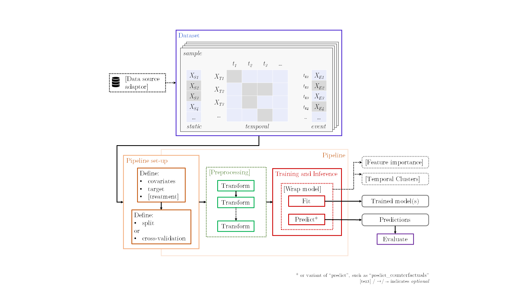

<!-- These are examples of badges you might want to add to your README:
     please update the URLs accordingly

[](https://cirrus-ci.com/github/<USER>/temporai)
[](https://coveralls.io/r/<USER>/temporai)
[](https://pypi.org/project/temporai/)
[](https://anaconda.org/conda-forge/temporai)
[](https://pepy.tech/project/temporai)
[](https://twitter.com/temporai)
-->


#  TemporAI

> **⚠️ Status**: **Work in progress, please come back at a later date.** We are migrating from a [previous iteration of the project](https://github.com/vanderschaarlab/clairvoyance).

*TemporAI* is a Machine Learning-centric time-series library for medicine.  The tasks that are currently of focus in TemporAI are: time-series prediction, time-to-event (a.k.a. survival) analysis with time-series data, and counterfactual inference (i.e. \[individualized\] treatment effects).  The library also aims to provide the user with understanding of their data, model, and problem, through e.g. integration with interpretability methods.

Key concepts:

<div align="center">


</div>

## 🚀 Installation

```bash
$ pip install temporai
```
or from source, using
```bash
$ pip install .
```

## 💥 Sample Usage
* List the available plugins
```python
from tempor.plugins import plugin_loader

print(plugin_loader.list())
```

* Use an imputer
```python
from tempor.utils.dataloaders.sine import SineDataLoader
from tempor.plugins import plugin_loader

dataset = SineDataLoader(with_missing=True).load()
assert dataset.static.dataframe().isna().sum().sum() != 0
assert dataset.time_series.dataframe().isna().sum().sum() != 0

# load the model
model = plugin_loader.get("preprocessing.imputation.bfill")

# train
model.fit(dataset)

# impute
imputed = model.transform(dataset)
assert imputed.static.dataframe().isna().sum().sum() == 0
assert imputed.time_series.dataframe().isna().sum().sum() == 0
```

* Use a classifier
```python
from tempor.utils.dataloaders.sine import SineDataLoader
from tempor.plugins import plugin_loader

dataset = SineDataLoader().load()

# load the model
model = plugin_loader.get("classification.nn_classifier", n_iter=50)

# train
model.fit(dataset)

# predict
assert model.predict(dataset).numpy().shape == (len(dataset), 1)
```

* Use a regressor
```python
from tempor.utils.dataloaders.sine import SineDataLoader
from tempor.plugins import plugin_loader

dataset = SineDataLoader().load()

# load the model
model = plugin_loader.get("regression.nn_regressor", n_iter=50)

# train
model.fit(dataset)

# predict
assert model.predict(dataset).numpy().shape == (len(dataset), 1)
```

* Benchmark models
```python
TODO
```


## 🔑 Methods
* Imputation

| Name | Description| Reference |
| --- | --- | --- |
| `preprocessing.imputation.ffill` | Propagate last valid observation forward to next valid  | --- |
| `preprocessing.imputation.bfill` | Use next valid observation to fill gap | --- |
| `preprocessing.imputation.static_imputation` | Use HyperImpute to impute both the static and temporal data | [Paper](https://arxiv.org/abs/2206.07769) |

* Classification

| Name | Description| Reference |
| --- | --- | --- |
| `classification.nn_classifier` | Neural-net based classifier. Supports multiple recurrent models, like RNN, LSTM, Transformer etc.  | --- |
| `classification.ode_classifier` | Classifier based on ordinary differential equation (ODE) solvers.  | --- |
| `classification.cde_classifier` | Classifier based Neural Controlled Differential Equations for Irregular Time Series.  | [Paper](https://arxiv.org/abs/2005.08926) |
| `classification.laplace_ode_classifier` | Classifier based Inverse Laplace Transform (ILT) algorithms implemented in PyTorch.  | [Paper](https://arxiv.org/abs/2206.04843) |

* Regression

| Name | Description| Reference |
| --- | --- | --- |
| `regression.nn_regressor` | Neural-net based regressor. Supports multiple recurrent models, like RNN, LSTM, Transformer etc.  | --- |
| `regression.ode_regressor` | Regressor based on ordinary differential equation (ODE) solvers.  | --- |
| `regression.cde_regressor` | Regressor based Neural Controlled Differential Equations for Irregular Time Series.  | [Paper](https://arxiv.org/abs/2005.08926)
| `regression.laplace_ode_regressor` | Regressor based Inverse Laplace Transform (ILT) algorithms implemented in PyTorch.  | [Paper](https://arxiv.org/abs/2206.04843) |

<!--
## Models

**Time Series Prediction (Forecasting)**

| Model &nbsp; &nbsp; &nbsp; &nbsp; &nbsp; &nbsp; &nbsp; &nbsp; &nbsp; &nbsp; &nbsp; &nbsp; &nbsp; &nbsp; &nbsp; &nbsp; &nbsp; | Affiliation &nbsp; &nbsp; &nbsp; &nbsp; &nbsp; &nbsp;&nbsp; &nbsp; &nbsp; &nbsp; | Paper | Status &nbsp; &nbsp; &nbsp; &nbsp; &nbsp; &nbsp; &nbsp; &nbsp; &nbsp; &nbsp; |
| ----- | ----------- | ----- | ------ |
| A version of LSTM | Classic method | [📄](https://ieeexplore.ieee.org/abstract/document/6795963) | ✔️ Available |
| A version of GRU | Classic method | [📄](https://arxiv.org/abs/1409.1259) | ✔️ Available |
| A version of Seq2Seq | Classic method | [📄](https://proceedings.neurips.cc/paper/2014/hash/a14ac55a4f27472c5d894ec1c3c743d2-Abstract.html) | ✔️ Available |
| [NeuralLaplace](https://github.com/samholt/NeuralLaplace) | [van der Schaar Lab] | [📄](https://proceedings.mlr.press/v162/holt22a.html) | 🔵 Planned |

**Time Series Imputation**

| Model &nbsp; &nbsp; &nbsp; &nbsp; &nbsp; &nbsp; &nbsp; &nbsp; &nbsp; &nbsp; &nbsp; &nbsp; &nbsp; &nbsp; &nbsp; &nbsp; &nbsp; | Affiliation &nbsp; &nbsp; &nbsp; &nbsp; &nbsp; &nbsp;&nbsp; &nbsp; &nbsp; &nbsp; | Paper | Status &nbsp; &nbsp; &nbsp; &nbsp; &nbsp; &nbsp; &nbsp; &nbsp; &nbsp; &nbsp; |
| ----- | ----------- | ----- | ------ |
| `{f,b}fill` & Mean | Classic method(s) | N/A | ✔️ Available |
| [HyperImpute](https://github.com/vanderschaarlab/HyperImpute) | [van der Schaar Lab] | [📄](https://proceedings.mlr.press/v162/jarrett22a/jarrett22a.pdf) | 🔵 Planned

**Temporal Treatment Effects**

| Model &nbsp; &nbsp; &nbsp; &nbsp; &nbsp; &nbsp; &nbsp; &nbsp; &nbsp; &nbsp; &nbsp; &nbsp; &nbsp; &nbsp; &nbsp; &nbsp; &nbsp; | Affiliation &nbsp; &nbsp; &nbsp; &nbsp; &nbsp; &nbsp;&nbsp; &nbsp; &nbsp; &nbsp; | Paper | Status &nbsp; &nbsp; &nbsp; &nbsp; &nbsp; &nbsp; &nbsp; &nbsp; &nbsp; &nbsp; |
| ----- | ----------- | ----- | ------ |
| [CRN](https://github.com/vanderschaarlab/mlforhealthlabpub/tree/main/alg/counterfactual_recurrent_network) | [van der Schaar Lab] | [📄](https://openreview.net/forum?id=BJg866NFvB) | ✔️ Available |
| [SyncTwin](https://github.com/vanderschaarlab/SyncTwin-NeurIPS-2021/) | [van der Schaar Lab] | [📄](https://proceedings.neurips.cc/paper/2021/hash/19485224d128528da1602ca47383f078-Abstract.html) | ➰ Experimental |
| [TE-CDE](https://github.com/vanderschaarlab/TE-CDE/) | [van der Schaar Lab] | [📄](https://proceedings.mlr.press/v162/seedat22b/seedat22b.pdf) | 🔵 Planned |

**Temporal Survival Analysis**

| Model &nbsp; &nbsp; &nbsp; &nbsp; &nbsp; &nbsp; &nbsp; &nbsp; &nbsp; &nbsp; &nbsp; &nbsp; &nbsp; &nbsp; &nbsp; &nbsp; &nbsp; | Affiliation &nbsp; &nbsp; &nbsp; &nbsp; &nbsp; &nbsp;&nbsp; &nbsp; &nbsp; &nbsp; | Paper | Status &nbsp; &nbsp; &nbsp; &nbsp; &nbsp; &nbsp; &nbsp; &nbsp; &nbsp; &nbsp; |
| ----- | ----------- | ----- | ------ |
| [Dynamic DeepHit Lite](https://github.com/chl8856/prostate_temporal) | [van der Schaar Lab] | [📄](https://www.nature.com/articles/s41746-022-00659-w) | ➰ Experimental |
| [Dynamic DeepHit](https://github.com/vanderschaarlab/mlforhealthlabpub/tree/main/alg/dynamic_deephit) | [van der Schaar Lab] | [📄](https://pubmed.ncbi.nlm.nih.gov/30951460/) | 🔵 Planned |

**Interpretability**

| Model &nbsp; &nbsp; &nbsp; &nbsp; &nbsp; &nbsp; &nbsp; &nbsp; &nbsp; &nbsp; &nbsp; &nbsp; &nbsp; &nbsp; &nbsp; &nbsp; &nbsp; | Affiliation &nbsp; &nbsp; &nbsp; &nbsp; &nbsp; &nbsp;&nbsp; &nbsp; &nbsp; &nbsp; | Paper | Status &nbsp; &nbsp; &nbsp; &nbsp; &nbsp; &nbsp; &nbsp; &nbsp; &nbsp; &nbsp; |
| ----- | ----------- | ----- | ------ |
| [DynaMask](https://github.com/vanderschaarlab/Dynamask) | [van der Schaar Lab] | [📄](https://proceedings.mlr.press/v139/crabbe21a.html) | 🔵 Planned |

**Temporal Clustering**

| Model &nbsp; &nbsp; &nbsp; &nbsp; &nbsp; &nbsp; &nbsp; &nbsp; &nbsp; &nbsp; &nbsp; &nbsp; &nbsp; &nbsp; &nbsp; &nbsp; &nbsp; | Affiliation &nbsp; &nbsp; &nbsp; &nbsp; &nbsp; &nbsp;&nbsp; &nbsp; &nbsp; &nbsp; | Paper | Status &nbsp; &nbsp; &nbsp; &nbsp; &nbsp; &nbsp; &nbsp; &nbsp; &nbsp; &nbsp; |
| ----- | ----------- | ----- | ------ |
| [AC-TPC](https://github.com/vanderschaarlab/mlforhealthlabpub/tree/main/alg/ac_tpc) | [van der Schaar Lab] | [📄](https://proceedings.mlr.press/v119/lee20h.html) | 🔵 Planned |

\* `✔️ Available` & `➰ Experimental` may include some items still to be migrated from the [previous iteration of the project](https://github.com/vanderschaarlab/clairvoyance2).
-->

## TemporAI Pipeline
The diagram below illustrates the structure of a *TemporAI* pipeline:



<!--
See [User Guide](user_guide/index) for tutorials/examples.
-->


<!--- Reusable --->
  [van der Schaar Lab]:    https://www.vanderschaar-lab.com/
  [docs]:                  https://temporai.readthedocs.io/en/latest/

## 🔨 Tests

Install the testing dependencies using
```bash
pip install .[dev]
```
The tests can be executed using
```bash
pytest -vsx
```

## Citing

If you use this code, please cite the associated paper:
```
TODO
```
